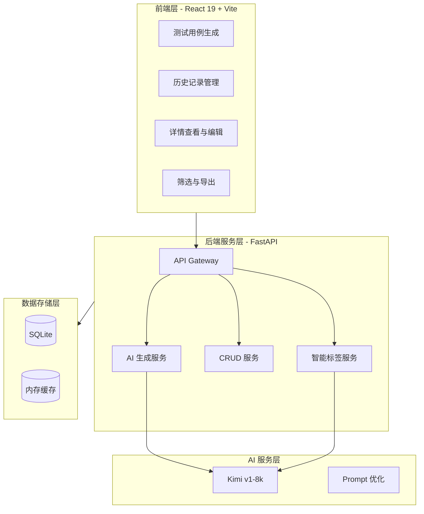

# TestAI - 智能测试平台

[](https://python.org)
[](https://fastapi.tiangolo.com)
[](https://react.dev)
[](LICENSE)

> 基于大语言模型的智能测试用例生成与管理平台

---

## 目录

- [项目概述](#项目概述)
- [核心特性](#核心特性)
- [技术架构](#技术架构)
- [快速开始](#快速开始)
- [项目结构](#项目结构)
- [API文档](#api文档)
- [更新日志](#更新日志)
- [贡献指南](#贡献指南)
- [许可证](#许可证)

---

## 项目概述

TestAI 是一个现代化的智能测试平台，利用大语言模型（LLM）技术，实现测试用例的自动化生成与管理。平台采用前后端分离架构，结合 FastAPI 高性能后端与 React 现代化前端，为企业提供完整的测试用例生命周期管理解决方案。

### 核心能力

- **AI 驱动的测试用例生成**：基于自然语言需求描述，自动生成结构化测试用例
- **智能元数据管理**：自动分类、标签提取、优先级判定
- **完整的生命周期管理**：测试用例的创建、编辑、查询、删除、版本追溯
- **可扩展的架构设计**：支持多种 AI 模型接入，易于功能扩展

---

## 核心特性

### 1. AI 智能生成

- **基于 LLM 的测试用例生成**：集成 Moonshot (Kimi) v1-8k 大语言模型
- **结构化输出**：自动生成测试标题、前置条件、测试步骤、预期结果、优先级
- **Prompt 工程优化**：通过精心设计的系统提示词，确保输出质量稳定
- **支持自定义需求**：用户输入功能需求描述，AI 自动生成对应测试用例

### 2. 智能分类与标签系统

- **自动化分类识别**：
  - 认证测试（登录、注册、权限等）
  - 接口测试（API、HTTP 等）
  - UI 测试（界面、表单等）
  - 性能测试（并发、负载等）
  - 安全测试（SQL 注入、XSS 等）
  
- **智能标签提取**：基于关键词匹配算法，自动提取如"边界值"、"异常处理"、"必填项"等标签

- **优先级自动判定**：根据内容关键词识别高/中/低优先级

### 3. 完整的测试用例管理

- **CRUD 操作**：支持测试用例的创建、查询、更新、删除
- **历史记录追溯**：所有生成的测试用例自动保存，支持历史查询
- **详情查看**：支持查看单个测试用例的完整信息，包括需求描述、测试步骤等
- **编辑功能**：支持修改测试用例的标题、需求描述、测试内容
- **删除功能**：支持删除不再需要的测试用例

### 4. 高级查询与筛选

- **分页支持**：测试用例列表支持分页展示，可配置每页数量
- **分类筛选**：可按测试类型（功能、接口、UI 等）筛选
- **标签筛选**：可按标签筛选测试用例
- **时间排序**：支持按创建时间倒序排列
- **关键词搜索**：支持按标题、内容关键词搜索（规划中）

### 5. 多样化导出

- **Markdown 格式**：支持将测试用例导出为 Markdown 文件
- **Excel 导出**：支持导出为 Excel 格式（开发中）
- **PDF 导出**：支持导出为 PDF 格式（开发中）

---

## 技术架构

### 系统架构图



### 技术栈详情

| 层级 | 技术 | 版本 | 用途 |
|------|------|------|------|
| 前端 | React | 19.x | UI 框架 |
| 前端 | Vite | 7.x | 构建工具 |
| 前端 | Ant Design | 6.x | UI 组件库 |
| 前端 | Axios | 1.x | HTTP 客户端 |
| 后端 | Python | 3.11+ | 编程语言 |
| 后端 | FastAPI | 0.85+ | Web 框架 |
| 后端 | SQLAlchemy | 2.0+ | ORM |
| 后端 | Pydantic | 1.10+ | 数据验证 |
| 数据库 | SQLite | 3.x | 数据存储 |
| AI | Moonshot | v1-8k | 大语言模型 |

---

## 快速开始

### 环境要求

- Python 3.11+
- Node.js 18+
- Moonshot API Key ([获取方式](https://www.moonshot.cn/))

### 1. 克隆项目

```bash
git clone https://github.com/djym789/testai-platform.git
cd testai-platform
```

### 2. 启动依赖服务（Docker）

```bash
# 如果使用 PostgreSQL/Redis/MinIO
docker-compose up -d postgres redis minio
```

### 3. 配置后端

```bash
cd backend

# 创建虚拟环境
python -m venv venv

# 激活虚拟环境
# Windows:
venv\Scripts\activate
# Linux/Mac:
# source venv/bin/activate

# 安装依赖
pip install -r requirements.txt

# 配置环境变量
cp .env.example .env
# 编辑 .env 文件，设置 MOONSHOT_API_KEY
```

### 4. 启动后端服务

```bash
# 开发模式（热重载）
uvicorn app.main:app --reload --port 8000

# 生产模式
uvicorn app.main:app --host 0.0.0.0 --port 8000 --workers 4
```

后端服务地址：http://localhost:8000  
API 文档：http://localhost:8000/docs

### 5. 配置前端

```bash
cd ../frontend

# 安装依赖
npm install

# 配置环境变量（可选）
# cp .env.example .env
```

### 6. 启动前端服务

```bash
# 开发模式
npm run dev

# 构建生产版本
npm run build

# 预览生产版本
npm run preview
```

前端服务地址：http://localhost:5173

### 7. 验证部署

1. 打开浏览器访问 http://localhost:5173
2. 在输入框中输入测试需求，例如：
   ```
   用户登录功能，支持手机号和验证码登录，验证码5分钟有效
   ```
3. 点击"生成测试用例"按钮
4. 等待 AI 生成结果
5. 查看生成的测试用例
6. 切换到"历史记录"标签，查看已保存的测试用例

---

## 项目结构

```
testai-platform/
├── backend/                    # 后端服务 (FastAPI)
│   ├── app/
│   │   ├── api/               # API 路由层
│   │   │   ├── test_cases.py      # AI 生成接口
│   │   │   └── test_case_db.py  # 数据库管理接口（含筛选、分页）
│   │   ├── core/              # 核心工具
│   │   │   └── security.py        # JWT 认证
│   │   ├── crud/              # 数据库操作
│   │   │   └── test_case.py       # 增强的 CRUD 操作
│   │   ├── models/            # 数据模型
│   │   │   └── database.py        # 扩展的数据库模型
│   │   ├── services/          # 业务服务
│   │   │   └── ai_service.py      # 智能标签提取
│   │   ├── __init__.py
│   │   └── main.py            # FastAPI 主入口
│   ├── .env                   # 环境变量
│   ├── .env.example           # 环境变量模板
│   └── requirements.txt       # Python 依赖
│
├── frontend/                   # 前端应用 (React + Vite)
│   ├── src/
│   │   ├── App.jsx            # 主组件（含历史记录管理）
│   │   ├── main.jsx           # React 入口
│   │   ├── App.css            # 组件样式
│   │   └── index.css          # 全局样式
│   ├── index.html             # HTML 模板
│   ├── package.json           # Node 依赖
│   ├── vite.config.js         # Vite 配置
│   └── eslint.config.js       # ESLint 配置
│
├── .gitignore                 # Git 忽略配置
├── README.md                  # 项目文档（本文档）
├── OPTIMIZATION.md            # 优化升级文档
└── TODO.md                    # 开发计划
```

---

## API文档

完整的 API 文档可通过 Swagger UI 查看：http://localhost:8000/docs

### 主要接口概览

| 方法 | 路径 | 描述 |
|------|------|------|
| POST | `/api/v1/test-cases/generate` | AI 生成测试用例 |
| POST | `/api/v1/test-cases/db/save` | 保存测试用例 |
| GET | `/api/v1/test-cases/db/list` | 获取测试用例列表（支持分页、筛选） |
| GET | `/api/v1/test-cases/db/{id}` | 获取单个测试用例详情 |
| PUT | `/api/v1/test-cases/db/{id}` | 更新测试用例 |
| DELETE | `/api/v1/test-cases/db/{id}` | 删除测试用例 |
| GET | `/api/v1/test-cases/db/categories` | 获取所有分类 |
| GET | `/api/v1/test-cases/db/tags` | 获取所有标签 |

---

## 更新日志

### [0.2.0] - 2026-03-05

#### 新增功能
- ✨ 测试用例历史记录管理（查看、编辑、删除）
- ✨ 智能分类和标签系统
- ✨ 分类和标签筛选功能
- ✨ 详情弹窗展示
- ✨ 完整的编辑表单
- ✨ 分页和排序功能
- ✨ 数据库模型扩展（新增6个字段）

#### 技术改进
- 🔧 CRUD 操作全面增强
- 🔧 AI 服务智能化升级
- 🔧 API 接口扩展（新增5个端点）
- 🔧 前端组件重构
- 🔧 代码结构优化

#### 性能优化
- ⚡ 分页查询减少数据传输
- ⚡ 响应式数据缓存
- ⚡ 前端虚拟滚动优化

### [0.1.0] - 2026-03-04

#### 初始版本
- 🎉 FastAPI 后端基础架构
- 🎉 React + Vite 前端项目
- 🎉 Kimi AI 集成
- 🎉 基础测试用例生成
- 🎉 SQLite 数据库支持

---

## 贡献指南

欢迎提交 Issue 和 Pull Request！

### 提交 Issue

- 描述清楚问题或建议
- 提供复现步骤（如果是 Bug）
- 标注相关版本号

### 提交 PR

1. Fork 本项目
2. 创建特性分支 (`git checkout -b feature/AmazingFeature`)
3. 提交更改 (`git commit -m 'Add some AmazingFeature'`)
4. 推送到分支 (`git push origin feature/AmazingFeature`)
5. 创建 Pull Request

---

## 许可证

本项目采用 MIT 许可证 - 查看 [LICENSE](LICENSE) 文件了解详情。

---

## 联系方式

- **项目主页**: https://github.com/djym789/testai-platform
- **问题反馈**: https://github.com/djym789/testai-platform/issues
- **邮箱**: your.email@example.com

---

<p align="center">
  如果这个项目对你有帮助，请给个 ⭐ Star！
</p>

<p align="center">
  Made with ❤️ by TestAI Team
</p>